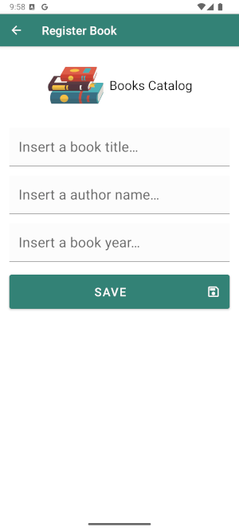
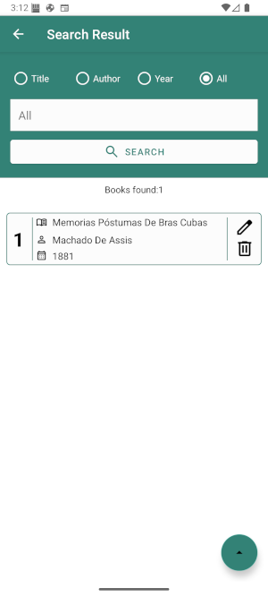
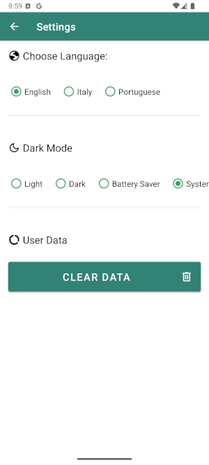

# 📚 Books Catalog

**An academic project evolving into a modern Android application, refactored with best practices and
advanced architecture.**

---

## 📝 About This Project

This project initially began as an academic assignment. Following its academic completion, I've
taken the initiative to substantially refactor and enhance the codebase. The core objective is to
apply and master modern Android development best practices, including:

- **MVVM (Model-View-ViewModel) Architecture:** To create a clear separation between UI logic,
  business logic, and data.
- **SOLID Principles:** Guiding the design to build a more understandable, flexible, and
  maintainable application.
- **Clean Code Practices:** Focusing on writing readable, simple, and self-documenting code.
- **Design Patterns:** Leveraging established solutions for common software design challenges.
- **Kotlin Flow:** For reactive and asynchronous data stream management.
- **Hilt:** For robust dependency injection.

This application is **currently a work in progress**. I am dedicated to continuously learning,
applying new techniques, and iteratively improving its structure, features, and overall code
quality.

---

## 🏗️ Architecture & Technologies

The application is being built using **Kotlin** and adheres to the **MVVM (Model-View-ViewModel)**
architectural pattern. The key components and technologies employed are:

* 🌐 **Core Language & Platform:**
    * **Kotlin:** The primary programming language.
    * **Android SDK:** Leveraging the latest Android features and APIs.

* 🧱 **Jetpack Components:**
    * **ViewModel:** Manages UI-related data in a lifecycle-conscious manner.
    * **StateFlow (Kotlin Flow):** Used extensively for observing data changes and reactively
      updating the UI, providing a modern approach to asynchronous data streams.
    * **Hilt:** For efficient and manageable dependency injection across the application.

* ⚙️ **Asynchronous Programming:**
    * **Coroutines & Flow:** For managing background tasks, handling asynchronous operations, and
      building reactive data flows.

* 🎨 **User Interface:**
    * **Material Design Components:** Ensuring a modern, visually appealing, and consistent user
      experience.
    * **ViewBinding:** For safer and more concise interaction with views.

* 🧩 **Principles & Practices:**
    * **MVVM Architecture:** As the foundational architectural pattern.
    * **SOLID Principles:** Applied to class and module design for better structure.
    * **Clean Code:** A continuous focus throughout the development lifecycle.
    * **Design Patterns:** Repository Pattern and Service Pattern.

**Dependency Injection:**
All dependencies are managed with **Hilt**, promoting modularity, testability, and a cleaner
codebase.

---

## 📸 Screenshots

Below are some of the main screens of the app:

- **Main Screen**
  
  

- **Book Register Screen**
  
  

- **Search Result Screen**
  
  

- **Settings Screen**
  
  

---

## 🔄 Future Updates

This README document is dynamic and will be updated as the "Books Catalog" project progresses. This
includes detailing new features, architectural enhancements, and any significant changes to the
technology stack.

---

## 🙏 Credits & Acknowledgements

* **Initial Academic Version:** Universidade Estácio de Sá
* **Refactoring & Enhancements:** Edoardo Fabrizio De Iovanna

---
